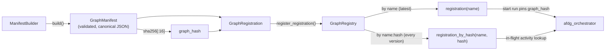

# DESIGN.md

Design Principles for `azure-functions-durable-graph`

## Purpose

This document defines the architectural boundaries and design principles of the project.

## Design Goals

- Compile graph definitions into a stable, versioned manifest that the orchestrator reads without violating determinism.
- Keep all user logic (node execution, routing, event handling) in Durable Functions activities, never inside the orchestrator.
- Provide a `ManifestBuilder` API that makes graph declaration explicit and typed.
- Automatically register HTTP endpoints for graph interaction without manual wiring.
- Stay small, focused, and independently useful within the Azure Functions ecosystem.

## Non-Goals

This project does not aim to:

- Become a full application framework
- Replace Azure Functions routing or hosting concepts
- Introduce hidden dependency injection or global state
- Own LLM client management, prompt engineering, or model hosting
- Provide automatic LangGraph translation (reserved for a future adapter)

## Design Principles

- The orchestrator must remain deterministic — it may only read manifests, call activities, and wait for events.
- Graph topology is compiled once at startup via `ManifestBuilder`; the orchestrator never infers structure at runtime.
- State contracts are enforced via Pydantic v2 models — no ad-hoc dict passing.
- Handler dispatch is explicit: `execute_node`, `resolve_route`, and `apply_event` are separate activities.
- Route handlers return typed `RouteDecision` objects with factory methods for clarity.
- Public APIs should evolve conservatively and follow semantic versioning.

## Ownership

This repository owns:

- Graph compilation (ManifestBuilder → GraphManifest → GraphRegistration)
- Runtime orchestration (deterministic Durable Functions orchestrator loop)
- State management (Pydantic v2 validation, shallow merge for dicts, full replacement for BaseModel)
- HTTP API (start run, poll status, send event, cancel, health, OpenAPI)
- Handler dispatch (node execution, route resolution, event application)
- Data contracts (RouteAction, RouteDecision, OrchestrationInput, request/response envelopes)

## Manifest to registration flow

The hash keying is what lets a redeploy change a graph while in-flight runs keep
executing against the exact version they started with (side-by-side deploys).

## What This Package Does Not Own

- LLM client management or prompt engineering
- Authentication and authorization
- Business/domain logic inside node handlers
- Data persistence beyond Durable Functions state
- Automatic LangGraph translation (future roadmap)

## Compatibility Policy

- Minimum supported Python version: `3.10`
- Supported runtime target: Azure Functions Python v2 programming model
- Orchestration provider: `azure-functions-durable`
- Public APIs follow semantic versioning expectations

## Change Discipline

- Orchestrator determinism violations must be caught by tests.
- Manifest format changes are breaking changes.
- Error payload changes are user-facing behavior changes.
- Experimental APIs must be clearly labeled in code and docs.
- Documentation examples and tests must stay synchronized with runtime behavior.

## Invariants

- `ManifestBuilder.build()` requires an entrypoint referencing a registered node.
- Terminal nodes cannot define `next_node` or `route_handler_name`.
- The orchestrator never calls user code directly.
- State merging is shallow for dict returns, full replacement for BaseModel returns.
- Route handlers can return `RouteDecision`, `str`, `dict`, or `None`.

## Immediate Improvement Areas

The v0.1.0a0 initial release established the core runtime:

- ~~manifest-first graph compilation~~ → done (`ManifestBuilder` + `GraphManifest`)
- ~~deterministic orchestrator loop~~ → done (all logic in activities)
- ~~typed state management~~ → done (Pydantic v2 models)
- ~~automatic HTTP endpoints~~ → done (start, status, event, cancel, health, openapi)

## Next Design Tasks

- Evaluate graph composition patterns for multi-graph orchestration
- Define the adapter boundary for future LangGraph StateGraph translation
- Consider pluggable state persistence providers beyond Durable Functions state
