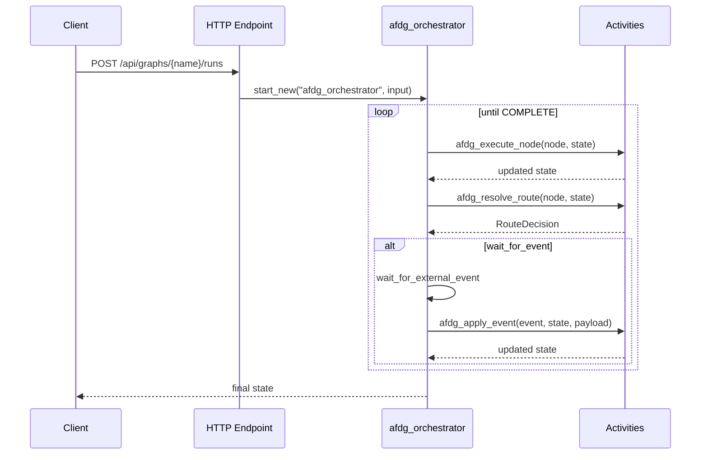

# Azure Functions Durable Graph

[](https://pypi.org/project/azure-functions-durable-graph/)
[](https://pypi.org/project/azure-functions-durable-graph/)
[](https://github.com/yeongseon/azure-functions-durable-graph-python/actions/workflows/ci-test.yml)
[](https://github.com/yeongseon/azure-functions-durable-graph-python/actions/workflows/publish-pypi.yml)
[](https://github.com/yeongseon/azure-functions-durable-graph-python/actions/workflows/security.yml)
[](https://codecov.io/gh/yeongseon/azure-functions-durable-graph-python)
[](https://pre-commit.com/)
[](https://yeongseon.github.io/azure-functions-durable-graph-python/)
[](LICENSE)

他の言語: [한국어](README.ko.md) | [English](README.md) | [简体中文](README.zh-CN.md)

> **Alpha版のお知らせ** — このパッケージは初期開発段階（`0.1.0a0`）です。リリース間でAPIが予告なく変更される場合があります。本番環境での使用前に十分なテストを行ってください。

**Azure Functions** と **Durable Functions** オーケストレーションのためのマニフェストファーストなグラフランタイムです。

---

**Azure Functions Python DX Toolkit** の一部
→ Azure Functions に FastAPI レベルの開発者体験を提供します

## なぜ必要か

Azure Functions でグラフ形状のワークフローを実行するのは、想像以上に困難です：

- **オーケストレーターの決定論性** — Durable Functions オーケストレーターは決定論的でなければなりません。LLM やツールを直接呼び出すとリプレイの安全性が損なわれます
- **グラフからランタイムへのギャップ** — ノード/エッジのグラフ設計を Durable Functions のアクティビティに変換するには、繰り返しのボイラープレートが必要です
- **標準ランタイムの不在** — 各チームがグラフ定義と Durable Functions プリミティブの接続を独自に構築しています

## 機能概要

- **マニフェストファーストランタイム** — グラフ定義を安定したバージョン管理されたマニフェストにコンパイルし、オーケストレーターの決定論性を維持します
- **自動 HTTP API** — `POST /api/graphs/{graph_name}/runs`、`GET /api/runs/{instance_id}`、イベント注入、キャンセル、ヘルスエンドポイントが自動的に登録されます
- **決定論的オーケストレーターループ** — すべてのユーザーロジック（ノード実行、ルーティング、イベント処理）は Durable Functions アクティビティで実行され、オーケストレーター内部では実行されません
- **条件付きルーティングと外部イベント** — `RouteDecision` によるブランチワークフローと human-in-the-loop パターンをサポートします

## スコープ

- Azure Functions Python **v2 プログラミングモデル**
- `azure-functions-durable` による Durable Functions オーケストレーション
- Pydantic v2 ベースの状態モデル
- グラフトポロジー：順次、条件付き、イベント駆動

このパッケージは LangGraph から独立しており、LangGraph への依存はありません。名前は LangGraph のノード/エッジモデルにインスパイアされています。

## 機能

- グラフノード、ルート、イベントハンドラーを宣言する `ManifestBuilder` API
- 構成可能な実行ループを持つ決定論的 Durable Functions オーケストレーター
- Pydantic v2 モデルによる型安全な状態管理
- 組み込み HTTP エンドポイント：実行開始、ステータス取得、イベント送信、キャンセル、ヘルス、OpenAPI
- マニフェスト派生ハッシュによるグラフバージョニングで安全なデプロイをサポート

## インストール

```bash
pip install azure-functions-durable-graph
```

Azure Functions アプリには以下も含めてください：

```text
azure-functions
azure-functions-durable
azure-functions-durable-graph
```

ローカル開発用：

```bash
git clone https://github.com/yeongseon/azure-functions-durable-graph-python.git
cd azure-functions-durable-graph
pip install -e .[dev]
```

## クイックスタート

```python
from pydantic import BaseModel

from azure_functions_durable_graph import DurableGraphApp, ManifestBuilder, RouteDecision


class MyState(BaseModel):
    message: str
    processed: bool = False


def process_message(state: MyState) -> dict:
    return {"processed": True}


def finalize(state: MyState) -> dict:
    return {"message": f"Done: {state.message}"}


builder = ManifestBuilder(graph_name="my_graph", state_model=MyState)
builder.set_entrypoint("process")
builder.add_node("process", process_message, next_node="finalize")
builder.add_node("finalize", finalize, terminal=True)

registration = builder.build()

runtime = DurableGraphApp()
runtime.register_registration(registration)
app = runtime.function_app
```

### 提供される機能

1. `POST /api/graphs/my_graph/runs` — 新しいグラフ実行を開始します
2. `GET /api/runs/{instance_id}` — 実行ステータスをポーリングします
3. `GET /api/health` — 登録済みグラフを一覧表示します
4. `GET /api/openapi.json` — OpenAPI ドキュメント

## デューラブル運用モデル

本番デプロイ前に把握すべきデューラブル固有の概念です。詳細は [Durable Concepts](docs/durable-concepts.md) を参照してください。

1. **オーケストレーターのライフサイクル** — オーケストレーターは決定的（deterministic）でリプレイ安全です。マニフェストを読み、アクティビティを呼び、イベントを待つだけで、`OrchestrationInput` の `graph_hash` でグラフバージョンを固定します。
2. **マニフェスト → 登録 → ランタイム** — `ManifestBuilder.build()` が検証済みでハッシュバージョンされた `GraphRegistration` をコンパイルし、`register_registration()` で登録し、実行時に現在の `graph_hash` に対してアクティビティを実行します。
3. **状態マージのセマンティクス** — ハンドラーが `dict` を返すと **浅いマージ**（トップレベルのキーのみ）、`BaseModel` は状態を **置換**、`None` は状態を **維持** します。ネストされた dict はディープマージされません。
4. **イベントと再開** — ルートハンドラーは `RouteDecision.wait_for_event(event_name, resume_node)` を返して実行を一時停止できます。`POST /api/runs/{instance_id}/events/{event_name}` でイベントを送ると `resume_node` から再開します。
5. **`host.json` は必須** — Durable Functions には Durable Task 拡張と拡張バンドルが必要です。[Deployment](docs/deployment.md) ガイドを参照してください。
6. **主な落とし穴** — 浅いマージ、`host.json` の忘れ、環境間でのタスクハブの再利用。[Troubleshooting](docs/troubleshooting.md) を参照。

## ランタイムフロー



## 使用するタイミング

- Azure Functions でグラフ形状の LLM ワークフローが必要な場合
- 手動のアクティビティ配線なしで決定論的な Durable Functions オーケストレーションが必要な場合
- Human-in-the-loop 承認パターン（外部イベント）が必要な場合
- トポロジーハッシュによるバージョン管理されたグラフデプロイが必要な場合

## サンプル

| サンプル | パターン | 主要コンセプト |
|---------|---------|----------------|
| [Data Pipeline](examples/data_pipeline/) | 順次実行 | `next_node` チェーン、状態蓄積 |
| [Content Classifier](examples/content_classifier/) | 条件分岐 | `RouteDecision.next()`、fan-in トポロジー |
| [Support Agent](examples/support_agent/) | Human-in-the-loop | `wait_for_event`、外部イベント、承認フロー |

## ドキュメント

- プロジェクトドキュメントは `docs/` にあります
- テスト済みの例は `examples/` にあります
- プロダクト要件：`PRD.md`
- 設計原則：`DESIGN.md`

## エコシステム

**Azure Functions Python DX Toolkit** の一部：

| パッケージ | 役割 |
|---------|------|
| [azure-functions-openapi-python](https://github.com/yeongseon/azure-functions-openapi-python) | OpenAPI スペック生成と Swagger UI |
| [azure-functions-validation-python](https://github.com/yeongseon/azure-functions-validation-python) | リクエスト/レスポンスのバリデーションとシリアライズ |
| [azure-functions-db-python](https://github.com/yeongseon/azure-functions-db-python) | SQLAlchemy ベースの DB 統合ヘルパー（ポーリングベースの擬似トリガー、入力/出力/クライアント注入） |
| [azure-functions-langgraph-python](https://github.com/yeongseon/azure-functions-langgraph-python) | Azure Functions 向け LangGraph デプロイアダプター |
| [azure-functions-scaffold-python](https://github.com/yeongseon/azure-functions-scaffold-python) | プロジェクトスキャフォールディング CLI |
| [azure-functions-logging-python](https://github.com/yeongseon/azure-functions-logging-python) | 構造化ロギングと可観測性 |
| [azure-functions-doctor-python](https://github.com/yeongseon/azure-functions-doctor-python) | デプロイ前診断 CLI |
| **azure-functions-durable-graph-python** | Durable Functions によるマニフェストファーストのグラフランタイム *(実験的)* |
| [azure-functions-knowledge-python](https://github.com/yeongseon/azure-functions-knowledge-python) | 知識検索（RAG）デコレーター |
| [azure-functions-cookbook-python](https://github.com/yeongseon/azure-functions-cookbook-python) | ドッグフード例 — ツールキット全体を活用する実行可能なレシピ |

## 免責事項

このプロジェクトは独立したコミュニティプロジェクトであり、Microsoft とは
提携・承認・保守の関係にありません。

Azure および Azure Functions は Microsoft Corporation の商標です。

## ライセンス

MIT
