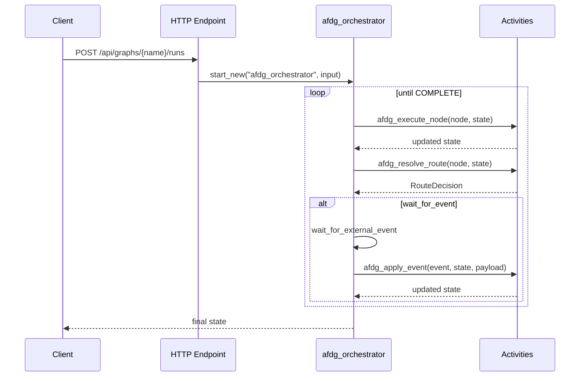

# Azure Functions Durable Graph

> ⚠️ **实验性（Experimental）** — 处于模式探索阶段。API 和行为可能会变化，暂不建议作为生产依赖使用。

[](https://pypi.org/project/azure-functions-durable-graph/)
[](https://pypi.org/project/azure-functions-durable-graph/)
[](https://github.com/yeongseon/azure-functions-durable-graph-python/actions/workflows/ci-test.yml)
[](https://github.com/yeongseon/azure-functions-durable-graph-python/actions/workflows/publish-pypi.yml)
[](https://github.com/yeongseon/azure-functions-durable-graph-python/actions/workflows/security.yml)
[](https://codecov.io/gh/yeongseon/azure-functions-durable-graph-python)
[](https://pre-commit.com/)
[](https://yeongseon.dev/azure-functions-python/durable-graph/)
[](LICENSE)

其他语言: [한국어](README.ko.md) | [日本語](README.ja.md) | [English](README.md)

> ℹ️ 本翻译由社区维护，仅供参考，可能落后于最新的 [English README](README.md)。请以英文版为准。

> **Alpha 版本声明** — 此包处于早期开发阶段（`0.1.0a0`）。API 可能在版本间发生不兼容变更，恕不另行通知。请在生产环境使用前进行充分测试。

面向 **Azure Functions** 和 **Durable Functions** 编排的清单优先（manifest-first）图运行时。

---

**Azure Functions Python DX Toolkit** 的一部分
→ 为 Azure Functions 带来 FastAPI 级别的开发者体验

## 为什么需要它

在 Azure Functions 上运行图状工作流比想象中更困难：

- **编排器确定性** — Durable Functions 编排器必须是确定性的；在其中直接调用 LLM 或工具会破坏重放安全性
- **图到运行时的鸿沟** — 将节点/边的图设计转换为 Durable Functions activity 需要大量重复的胶水代码
- **缺乏标准运行时** — 每个团队都在自行构建图定义和 Durable Functions 原语之间的连接

## 功能概述

- **清单优先运行时** — 将图定义编译为稳定的、版本化的清单，编排器读取清单而不违反确定性
- **自动 HTTP API** — `POST /api/graphs/{graph_name}/runs`、`GET /api/runs/{instance_id}`、事件注入、取消和健康端点自动注册
- **确定性编排器循环** — 所有用户逻辑（节点执行、路由、事件处理）在 Durable Functions activity 中运行，绝不在编排器内部运行
- **条件路由与外部事件** — 通过 `RouteDecision` 支持分支工作流和人机回圈（human-in-the-loop）模式

## 范围

- Azure Functions Python **v2 编程模型**
- 通过 `azure-functions-durable` 进行 Durable Functions 编排
- 基于 Pydantic v2 的状态模型
- 图拓扑：顺序、条件和事件驱动

此包与 LangGraph 独立，不依赖于 LangGraph。名称灵感来源于 LangGraph 的节点/边模型。

## 特性

- 用于声明图节点、路由和事件处理器的 `ManifestBuilder` API
- 具有可配置执行循环的确定性 Durable Functions 编排器
- 通过 Pydantic v2 模型实现类型安全的状态管理
- 内置 HTTP 端点：启动运行、获取状态、发送事件、取消、健康检查、OpenAPI
- 基于清单派生哈希的图版本控制，确保安全部署

## 安装

```bash
pip install azure-functions-durable-graph
```

你的 Azure Functions 应用还需要包含：

```text
azure-functions
azure-functions-durable
azure-functions-durable-graph
```

本地开发：

```bash
git clone https://github.com/yeongseon/azure-functions-durable-graph-python.git
cd azure-functions-durable-graph
pip install -e .[dev]
```

## 快速开始

```python
from pydantic import BaseModel

from azure_functions_durable_graph import DurableGraphApp, ManifestBuilder, RouteDecision


class MyState(BaseModel):
    message: str
    processed: bool = False


def process_message(state: MyState) -> dict:
    return {"processed": True}


def finalize(state: MyState) -> dict:
    return {"message": f"Done: {state.message}"}


builder = ManifestBuilder(graph_name="my_graph", state_model=MyState)
builder.set_entrypoint("process")
builder.add_node("process", process_message, next_node="finalize")
builder.add_node("finalize", finalize, terminal=True)

registration = builder.build()

runtime = DurableGraphApp()
runtime.register_registration(registration)
app = runtime.function_app
```

### 你将获得

1. `POST /api/graphs/my_graph/runs` — 启动新的图执行
2. `GET /api/runs/{instance_id}` — 轮询运行状态
3. `GET /api/health` — 列出已注册的图
4. `GET /api/openapi.json` — OpenAPI 文档

## 运行时模型（Durable）

上生产前需要了解的 Durable 特有概念。详情请参阅 [Durable Concepts](docs/durable-concepts.md)。

1. **编排器生命周期** — 编排器是确定性的（deterministic）且重放安全。它只读取清单、调用活动并等待事件，通过 `OrchestrationInput` 中的 `graph_hash` 锁定图版本。
2. **清单 → 注册 → 运行时** — `ManifestBuilder.build()` 编译出经验证、按哈希版本化的 `GraphRegistration`；`register_registration()` 完成注册；运行时针对当前 `graph_hash` 执行活动。
3. **状态合并语义** — 处理函数返回 `dict` 时为 **浅合并**（仅顶层键），`BaseModel` 会 **替换** 状态，`None` 则 **保持不变**。嵌套 dict 不会深度合并。
4. **事件与恢复** — 路由处理函数可返回 `RouteDecision.wait_for_event(event_name, resume_node)` 来暂停运行；通过 `POST /api/runs/{instance_id}/events/{event_name}` 发送事件后从 `resume_node` 恢复。
5. **必须提供 `host.json`** — Durable Functions 需要 Durable Task 扩展和扩展包。请参阅 [Deployment](docs/deployment.md) 指南。
6. **常见陷阱** — 浅合并意外、遗漏 `host.json`、在不同环境间复用任务中心。参见 [Troubleshooting](docs/troubleshooting.md)。

## 运行时流程



## 适用场景

- 需要在 Azure Functions 上运行图状 LLM 工作流
- 需要确定性的 Durable Functions 编排，无需手动 activity 连线
- 需要人机回圈审批模式（外部事件）
- 需要基于拓扑哈希的版本化图部署

## 示例

| 示例 | 模式 | 核心概念 |
|------|------|----------|
| [Data Pipeline](examples/data_pipeline/) | 顺序执行 | `next_node` 链式调用、状态累积 |
| [Content Classifier](examples/content_classifier/) | 条件路由 | `RouteDecision.next()`、fan-in 拓扑 |
| [Support Agent](examples/support_agent/) | 人机回圈 | `wait_for_event`、外部事件、审批流程 |

## 文档

- 项目文档位于 `docs/` 目录下
- 经过测试的示例位于 `examples/` 目录下
- 产品需求：`PRD.md`
- 设计原则：`DESIGN.md`

## 生态系统

**Azure Functions Python DX Toolkit** 的一部分：

| 包 | 职责 |
|---------|------|
| [azure-functions-openapi-python](https://github.com/yeongseon/azure-functions-openapi-python) | OpenAPI 规范生成与 Swagger UI |
| [azure-functions-validation-python](https://github.com/yeongseon/azure-functions-validation-python) | 请求/响应校验与序列化 |
| [azure-functions-db-python](https://github.com/yeongseon/azure-functions-db-python) | 基于 SQLAlchemy 的数据库集成助手（基于轮询的伪触发器，输入/输出/客户端注入） |
| [azure-functions-langgraph-python](https://github.com/yeongseon/azure-functions-langgraph-python) | 面向 Azure Functions 的 LangGraph 部署适配器 |
| [azure-functions-scaffold-python](https://github.com/yeongseon/azure-functions-scaffold-python) | 项目脚手架 CLI |
| [azure-functions-logging-python](https://github.com/yeongseon/azure-functions-logging-python) | 结构化日志与可观测性 |
| [azure-functions-doctor-python](https://github.com/yeongseon/azure-functions-doctor-python) | 部署前诊断 CLI |
| **azure-functions-durable-graph-python** | 基于 Durable Functions 的清单优先图运行时 *(实验性)* |
| [azure-functions-knowledge-python](https://github.com/yeongseon/azure-functions-knowledge-python) | 知识检索（RAG）装饰器 |
| [azure-functions-cookbook-python](https://github.com/yeongseon/azure-functions-cookbook-python) | 内部实践示例 — 可运行的完整工具链演示 |

## 免责声明

本项目是独立的社区项目，与 Microsoft 无任何关联、
背书或维护关系。

Azure 和 Azure Functions 是 Microsoft Corporation 的商标。

## 许可证

MIT
