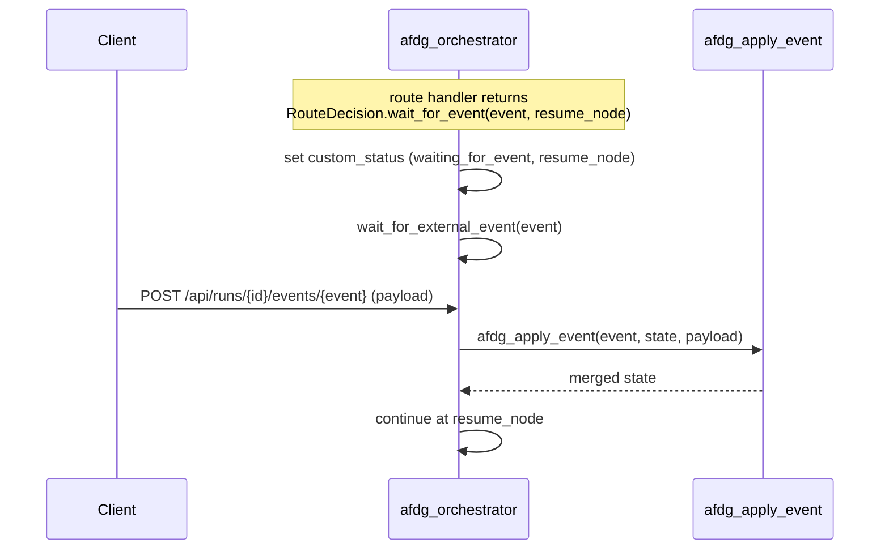
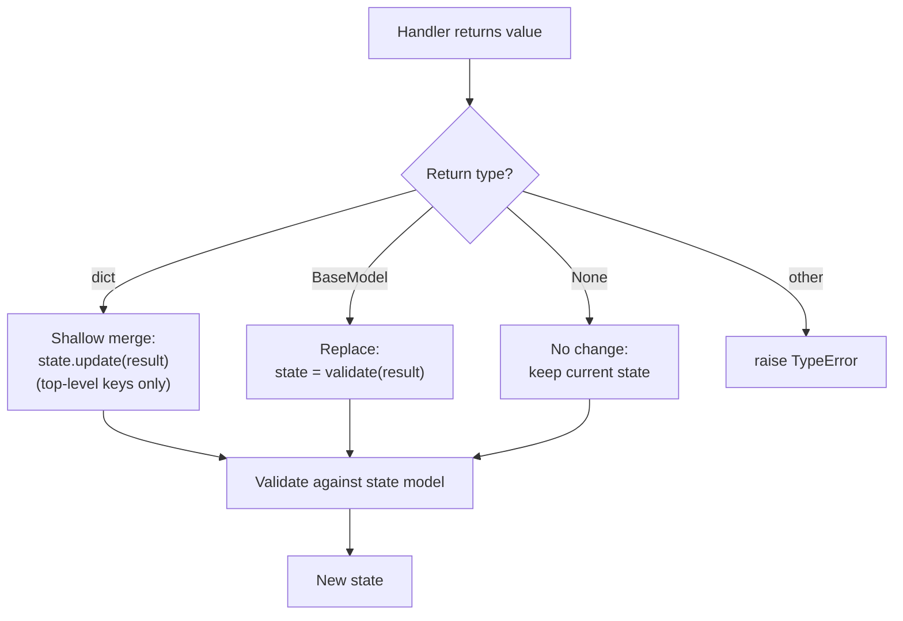

# Usage

This guide covers production patterns for `azure-functions-durable-graph` in the Azure
Functions Python v2 programming model with Durable Functions.

If you are new to the package, start with [Quickstart](getting-started.md) and
then return here for deeper patterns.

## Baseline Pattern

```python
from pydantic import BaseModel

from azure_functions_durable_graph import DurableGraphApp, ManifestBuilder


class OrderState(BaseModel):
    order_id: str
    validated: bool = False
    shipped: bool = False


def validate_order(state: OrderState) -> dict:
    return {"validated": True}


def ship_order(state: OrderState) -> dict:
    return {"shipped": True}


builder = ManifestBuilder(graph_name="order_flow", state_model=OrderState)
builder.set_entrypoint("validate")
builder.add_node("validate", validate_order, next_node="ship")
builder.add_node("ship", ship_order, terminal=True)

runtime = DurableGraphApp()
runtime.register_registration(builder.build())
app = runtime.function_app
```

!!! tip "Mental model"
    Think of the manifest as an intermediate representation: graph topology is
    compiled once at startup, and the orchestrator reads it without executing
    arbitrary user code.

## Sequential flow

The simplest pattern chains nodes with `next_node`:

```python
builder.add_node("a", handler_a, next_node="b")
builder.add_node("b", handler_b, next_node="c")
builder.add_node("c", handler_c, terminal=True)
```

## Conditional routing

Use a route handler to pick the next node dynamically:

```python
from azure_functions_durable_graph import RouteDecision


def route_after_classify(state: TicketState) -> RouteDecision:
    if state.category == "urgent":
        return RouteDecision.next("escalate")
    return RouteDecision.next("auto_reply")


builder.add_node("classify", classify, route=route_after_classify)
builder.add_node("escalate", escalate, terminal=True)
builder.add_node("auto_reply", auto_reply, terminal=True)
```

### String shorthand

Route handlers can return a plain string instead of `RouteDecision`:

```python
def route_after_classify(state: TicketState) -> str:
    if state.category == "urgent":
        return "escalate"
    return "auto_reply"
```

Use `"__complete__"` to signal graph completion from a route handler.

## External events (human-in-the-loop)

For approval workflows or human-in-the-loop patterns, use `wait_for_event`:

```python
def route_after_review(state: ReviewState) -> RouteDecision:
    if state.needs_approval:
        return RouteDecision.wait_for_event(
            event_name="manager_approval",
            resume_node="apply_decision",
        )
    return RouteDecision.next("apply_decision")


def merge_approval(state: ReviewState, payload: dict) -> dict:
    return {
        "approved": payload.get("approved", False),
        "reviewer": payload.get("reviewer"),
    }


builder.add_event_handler("manager_approval", merge_approval)
```

### Sending events via HTTP

```bash
curl -X POST http://localhost:7071/api/runs/{instance_id}/events/manager_approval \
  -H "Content-Type: application/json" \
  -d '{"approved": true, "reviewer": "alice@example.com"}'
```

The full event lifecycle — pause, deliver, apply, resume:



## State merging

Node handlers return partial state updates. The runtime merges them:

```python
def handler(state: MyState) -> dict:
    # Only updates "processed" — other fields are preserved
    return {"processed": True}
```

Merge rules:

- `dict` return → shallow merge into current state
- `BaseModel` return → full replacement (validated against state model)
- `None` return → state unchanged

!!! warning "Shallow merge"
    Dict returns perform shallow merge. Nested dicts are replaced entirely,
    not recursively merged.



## Async handlers

Both sync and async handlers are supported:

```python
async def call_llm(state: AgentState) -> dict:
    response = await llm_client.complete(state.prompt)
    return {"llm_response": response}
```

The runtime uses `_maybe_await` internally to handle both transparently.

## Multiple graphs

Register multiple graphs on a single `DurableGraphApp`:

```python
runtime = DurableGraphApp()
runtime.register_registration(order_flow_registration)
runtime.register_registration(support_agent_registration)
app = runtime.function_app
```

Each graph gets its own API route: `/api/graphs/{graph_name}/runs`.

## Cancelling runs

```bash
curl -X POST http://localhost:7071/api/runs/{instance_id}/cancel \
  -H "Content-Type: application/json" \
  -d '{"reason": "user requested cancellation"}'
```

## Graph versioning

The manifest includes a `graph_hash` derived from the canonical JSON of the full
manifest (graph name, version, state model, nodes, edges, event handlers, and metadata).
This hash changes when any part of the manifest changes, enabling safe
side-by-side deployments.

```python
reg = builder.build()
print(reg.manifest.graph_hash)  # e.g., "a1b2c3d4e5f67890"
```

## Testing graph registrations

Test your graph logic without Azure Functions infrastructure:

```python
import pytest
from pydantic import BaseModel

from azure_functions_durable_graph import ManifestBuilder


class State(BaseModel):
    value: int = 0


def increment(state: State) -> dict:
    return {"value": state.value + 1}


def test_graph_build():
    b = ManifestBuilder(graph_name="test", state_model=State)
    b.set_entrypoint("inc")
    b.add_node("inc", increment, terminal=True)
    reg = b.build()

    assert reg.manifest.graph_name == "test"
    assert reg.manifest.entrypoint == "inc"
    assert "inc" in reg.manifest.nodes
```

## Common gotchas

- Orchestrator determinism: never put LLM calls or I/O in the orchestrator — all
  user logic runs in activities.
- Terminal nodes cannot define `next_node` or `route`.
- State model must be a Pydantic v2 `BaseModel`.
- `DurableGraphApp` registers all HTTP routes and activities on construction.

See [Troubleshooting](troubleshooting.md) for issue-by-issue fixes.

## Related pages

- [Configuration](configuration.md)
- [API Reference](api.md)
- [Architecture](architecture.md)
- [FAQ](faq.md)
- [Data Pipeline Example](examples/data_pipeline.md)
- [Content Classifier Example](examples/content_classifier.md)
- [Support Agent Example](examples/support_agent.md)
